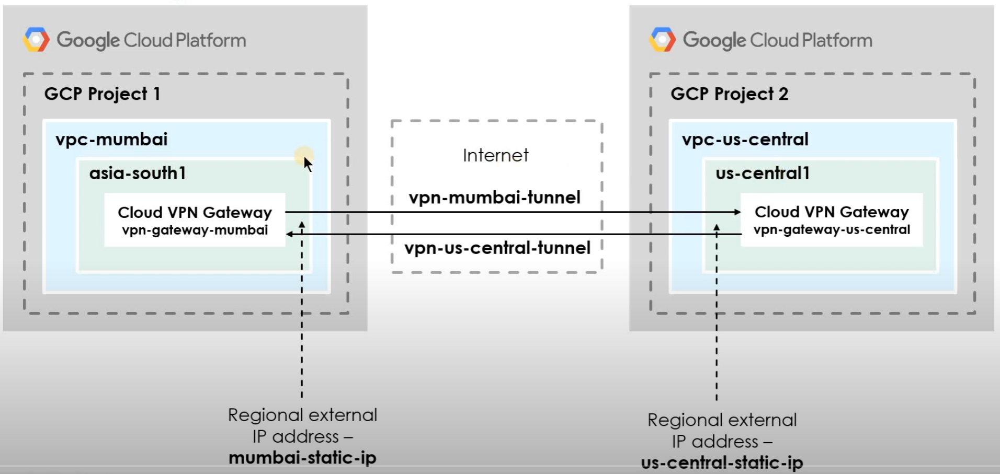
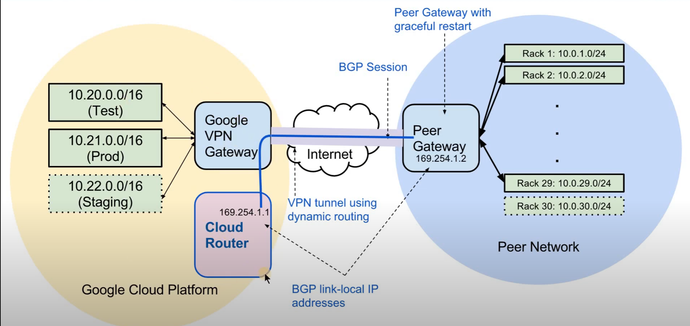
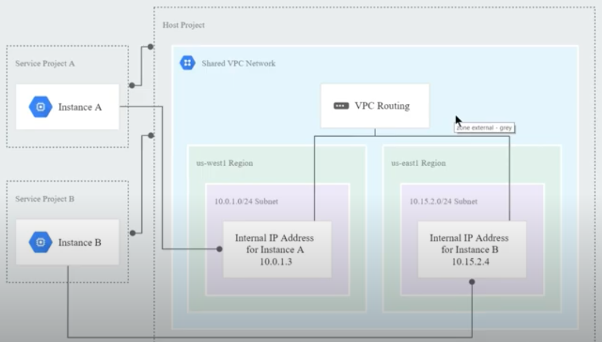
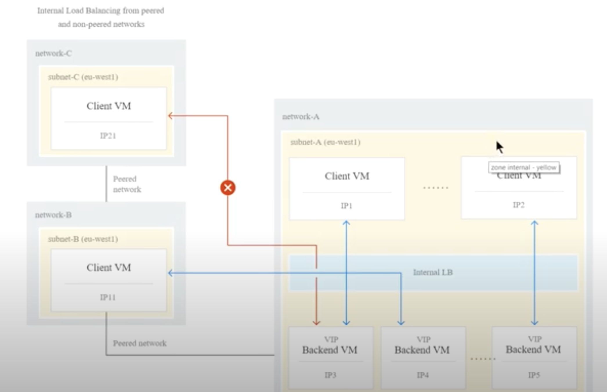
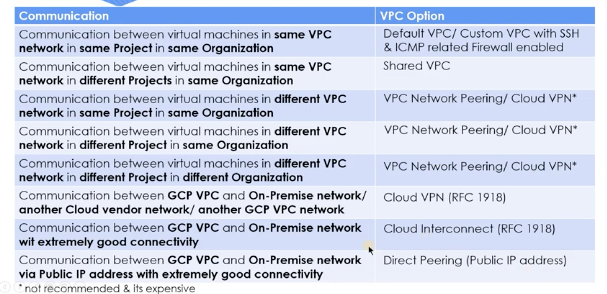
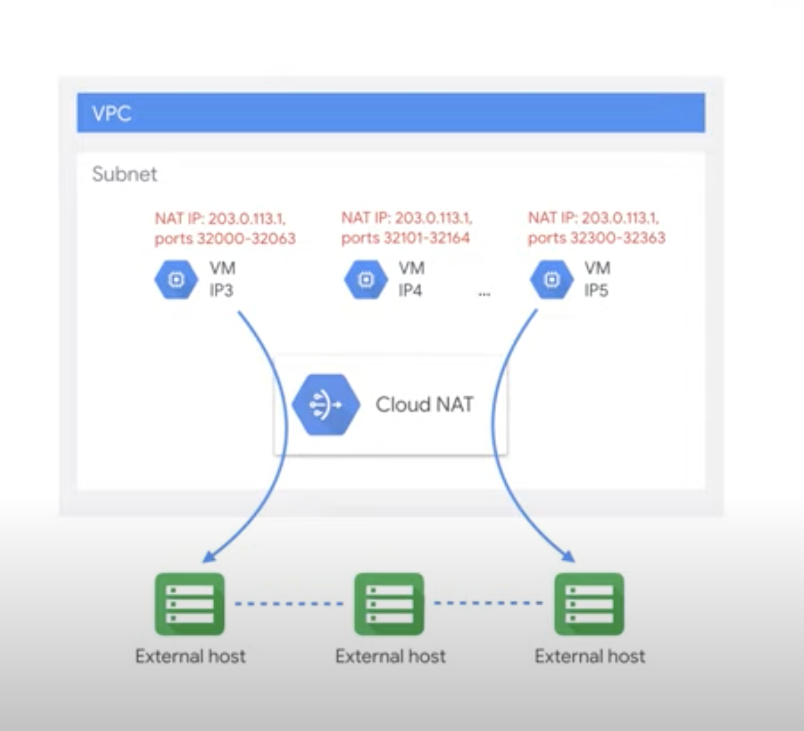

# gcp-cloud-network-engineer-exam-examples

A set of practical examples that covers the [Professional Cloud Network Engineer](https://cloud.google.com/certification/guides/cloud-network-engineer) exam objectives.

### CLoud VPN Static Routing

### CLoud VPN Dynamic Routing

### Shared VPC

### VPC Peering

### VPC Options

### Cloud NAT

